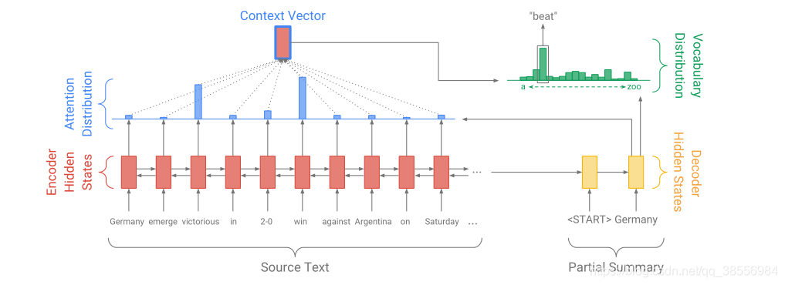
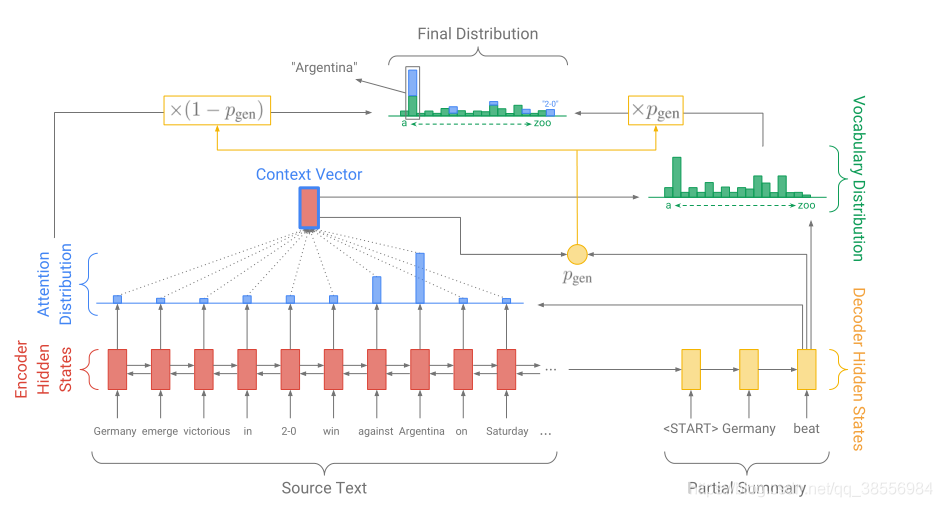

### 项目概要

文本生成（Text Generation）具体可以细分成文本摘要、机器翻译、故事续写等几种任务。本项目主要用到的是文本摘要（Summarization）的技术。我们生成摘要的方式是选取其中关键的句子摘抄下来。相反，生成式摘要则是希望通过学习原文的语义信息后相应地生成一段较短但是能反应其核心思想的文本作为摘要。生成式
摘要相较于抽取式摘要更加灵活，但也更加难以实现。本项目我们将会先用生成式摘要的方法构建一个 Seq2seq+Attention的模型作为 baseline，然后构建一个结合了生成式和抽取式两种方法的 Pointer-Generator Network（PGN）模型。

在本项目中，涉及的内容有：

* (Seq2seq、Attention、LSTM、PGN 、converage等模型）的实现。
* 训练神经网络（调参、debug、可视化）。
* 实现 Beam Search 算法来生成文本。
* 掌握文本生成任务的评估方法。
* 掌握深度学习训练的一些优化技巧（Scheduled sampling、Weight tying等）。
* 了解如何使用多种文本增强技术处理少样本问题。

文本生成任务中，我们作为输入的原文称之为 source，待生成的目标文本称之为 target 或者 hypothesis，用来作为 target 好坏的参考文本称之为reference。在本项目的数据源来自于京东电商的发现好货栏目，source 主
要由三部分构成：1 是商品的标题，2 是商品的参数，3 是商品宣传图片里提取出来的宣传文案（借助OCR）。

复现论文Get To The Point: Summarization with Pointer-Generator Networks 中的框架。
以Seq2Seq + attention作为baseline,如图

  

改进模型用PNG(Pointer-Generator Networks + coverage)

评估模型指标使用Rouge分数 

